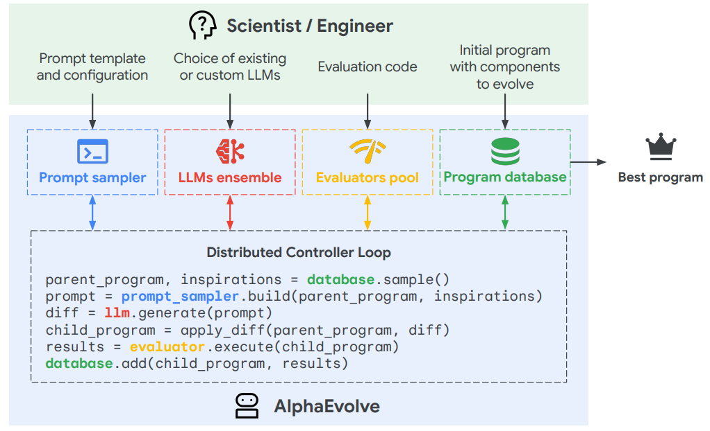

# **Project AlphaEvolve: An LLM-driven Agent for Algorithmic Discovery 🧬**

This project is a hands-on exploration into the world of AI-driven scientific discovery, inspired by landmark papers like Google DeepMind's AlphaEvolve. It features a custom-built evolutionary agent that leverages the power of Large Language Models (LLMs) to discover, optimize, and invent computer algorithms from scratch.

The core question: **Can an AI agent, powered by Google's Gemini, evolve and discover novel, efficient algorithms for classic computer science problems?**

The answer, as demonstrated through a series of controlled experiments, is a resounding yes.

## **🚀 The Core Engine: How It Works**

The system is built on a classic evolutionary loop, but with a modern twist: the "mutation" and "crossover" events are powered by an LLM, allowing for intelligent, semantic changes to the code rather than random ones. This project is a practical implementation of the official AlphaEvolve architecture shown below.

The core workflow consists of these steps:

1. **The Population:** A collection of the best-performing algorithms found so far.  
2. **Parent Selection:** One or two of the best "parent" algorithms are selected from the population.  
3. **The Prompt Engine:** The parent algorithms are embedded into a carefully crafted prompt, instructing the LLM to either mutate (improve one parent) or perform a crossover (combine the ideas of two parents).  
4. **The LLM "Creator":** The prompt is sent to the Gemini 1.5 Flash API, which generates a new "child" algorithm.  
5. **The Test Harness:** This automated "judge" rigorously tests the new algorithm for correctness and performance.  
6. **Survival of the Fittest:** If the new algorithm is correct and performs well, it is added to the population, and the weakest members are culled.

## **📊 Summary of Results**

This table summarizes the key findings from each experiment, showing the progression from a simple baseline to the discovery of sophisticated, from-scratch algorithms.

| Experiment | Strategy | Algorithm Discovered | Final Performance Score\* | View Code | View Plot |
| :---- | :---- | :---- | :---- | :---- | :---- |
| **Baseline** | Unconstrained | Built-in sorted() | \~0.000225 | N/A | N/A |
| **Constraint** | Mutation | Selection Sort | \~0.001313 | [Code](https://www.google.com/search?q=results/best_constrained_algorithm.py) | [Plot](https://www.google.com/search?q=results/constrained_history.png) |
| **Crossover** | Crossover | **Hybrid Cocktail Sort** | **\~0.000762** | [Code](https://www.google.com/search?q=results/best_crossover_algorithm.py) | [Plot](https://www.google.com/search?q=results/crossover_history.png) |
| **New Domain** | Crossover | Two-Pointer Swap | \~0.000510 | [Code](https://www.google.com/search?q=results/best_reversal_algorithm.py) | [Plot](https://www.google.com/search?q=results/reversal_history.png) |

*\*Lower score is better. Scores represent total execution time on a standardized test harness. You will need to rename your saved plot files to match the links above (e.g., constrained\_history.png).*

## **🔬 The Research Journey: A Tale of Four Experiments**

The project evolved through a series of carefully designed experiments, each building on the last.

### **Experiment 1: The Unconstrained Baseline (Sorting)**

* **Research Question:** What is the most optimal algorithm the AI can find for sorting a list if given no constraints?  
* **Result:** The AI quickly discovered the most efficient solution possible in Python: return sorted(arr).  
* **Finding:** This proved the system's core ability to optimize by finding the globally optimal solution for the given environment.

### **Experiment 2: The Constraint Experiment**

* **Research Question:** What happens if we forbid the AI from using shortcuts and force it to build an algorithm from first principles?  
* **Result:** The system discovered a classic, fundamental sorting algorithm: **Selection Sort**.  
* **Finding:** This proved the AI's ability to reason about algorithms from scratch when properly constrained.

### **Experiment 3: The Crossover Strategy**

* **Research Question:** Can a more advanced "crossover" strategy (combining ideas from two parents) discover a better algorithm than simple "mutation"?  
* **Result:** The AI discovered a sophisticated, creative hybrid algorithm that sorts from both ends at once.  
* **Finding:** Yes. The crossover strategy consistently led to the discovery of more complex and efficient algorithms like **Cocktail Shaker Sort** and **Bidirectional Selection Sort**.

### **Experiment 4: Generalizing to a New Domain (String Reversal)**

* **Research Question:** Is this engine just a sorter, or can it solve other types of problems?  
* **Result:** After adapting the test harness and prompts, the engine discovered the canonical, efficient solution: the **Two-Pointer Swap** algorithm.  
* **Finding:** The engine is **general-purpose**. It successfully generalized its discovery capability to a completely different problem domain.

## **🛠️ Tech Stack**

* **Language:** Python 3  
* **Core AI:** Google Gemini 1.5 Flash API  
* **Data Analysis & Plotting:** Matplotlib  
* **Environment:** venv, python-dotenv

## **⚙️ Running the Experiments**

1. **Clone the Repository:**  
   git clone \[https://github.com/YOUR\_USERNAME/project-alphaevolve.git\](https://github.com/YOUR\_USERNAME/project-alphaevolve.git)  
   cd project-alphaevolve

2. **Set Up the Environment:**  
   python3 \-m venv venv  
   source venv/bin/activate  \# On Windows: .\\venv\\Scripts\\activate

3. **Install Dependencies:**  
   pip install \-r requirements.txt

4. **Configure Your API Key:**  
   * Create a .env file in the root directory.  
   * Add your Gemini API key to it: GEMINI\_API\_KEY="YOUR\_API\_KEY\_HERE"  
5. **Run an Experiment:**  
   * Open and run any of the experiment files (e.g., experiment\_crossover.py).  
   * Results will be saved in the results/ folder.

## **🌟 What I Learned (Key Takeaways)**

* **LLMs as Creative Engines:** LLMs are incredibly powerful tools for intelligent "mutation" and "crossover" in evolutionary algorithms.  
* **The Power of Constraints:** The most interesting discoveries happened when the AI was given clear constraints, forcing it to be genuinely creative.  
* **Generalization is Key:** The success of the string reversal experiment demonstrates that this architecture is a general-purpose framework for code optimization.

## **🤝 Future Work & Collaboration Opportunities**

This project is a starting point, and there are many exciting avenues for future research and collaboration. I am actively looking for opportunities to expand this work and would welcome any discussion or partnership.

* **Tackling New Domains:** The framework is ready to be tested against more complex problems. I am particularly interested in exploring:  
  * **Pathfinding Algorithms:** Can the engine evolve an algorithm like Dijkstra's from a simple brute-force search?  
  * **Data Structures:** Could the system design an efficient implementation of a simple data structure, like a stack or queue?  
  * **Simple Data Compression:** Can the AI discover a basic run-length encoding algorithm?  
* **Enhancing the Engine:** There is significant room to improve the core evolutionary engine:  
  * **Advanced Prompt Engineering:** Developing more sophisticated prompts for mutation and crossover.  
  * **Meta-Evolution:** Creating a system where the AI evolves its own prompts to become a better programmer over time.  
  * **Local Model Integration:** Adapting the engine to use open models like Gemma running locally.

I believe this research direction has immense potential. If you are a researcher, student, or engineer interested in this field, please feel free to open an issue on GitHub to discuss ideas or reach out to me directly.